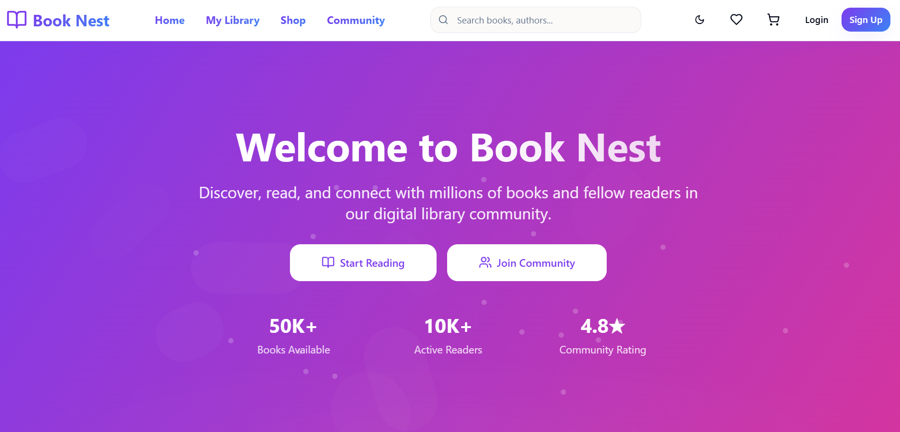
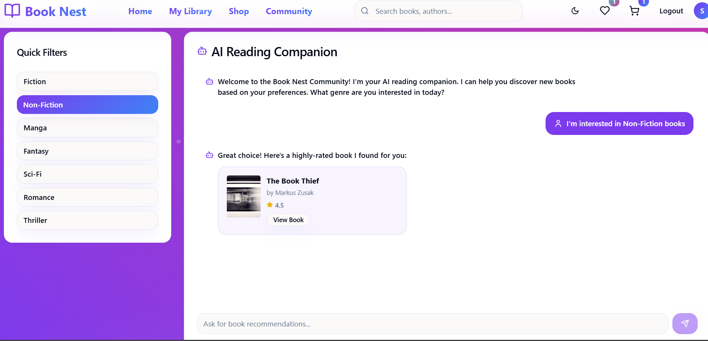
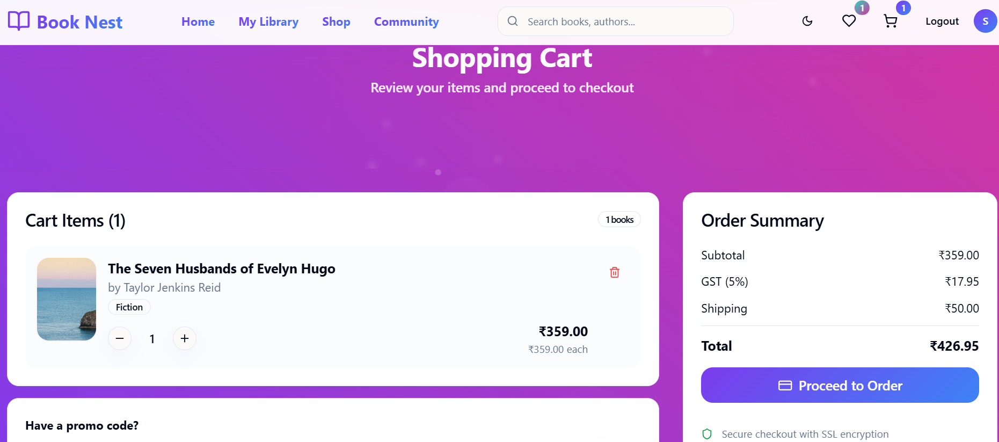
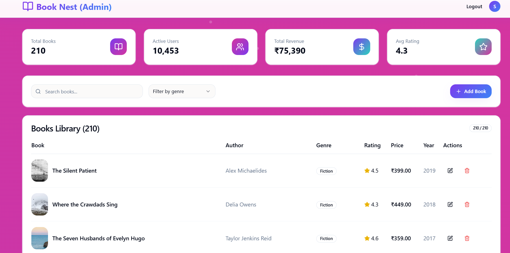

# 📚 BookNest

BookNest is a modern digital library platform where users can explore, read, and purchase books online. It includes features like book discovery, community interaction, and a user-friendly reading interface.

---

## 🚀 Features

- 🔐 User Authentication
- 📖 Online Book Reader
- 🛒 Book Purchase & Cart System
- 💬 Community Discussion
- ⭐ Reviews & Ratings
- 🎨 Modern UI with Animations
- 📱 Responsive Design

---

## 🛠 Tech Stack

Frontend:
- React.js
- Tailwind CSS
- Framer Motion
- Redux Toolkit

Tools:
- Git
- GitHub
- VS Code

---

## 📸 Screenshots

### Home Page


### Community Page


### My Cart


### Admin Dashboard


---

## ▶ Run the Project

```bash
npm install
npm run dev

Author

Subhasmita Rath


After editing README run:

```bash
git add README.md
git commit -m "Updated professional README"
git push
